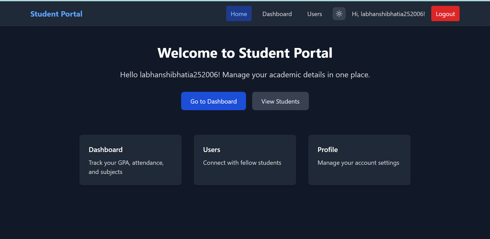

# 🎓 Student Portal Web App

A responsive student portal built using **React**, **TypeScript**, **Tailwind CSS**, and **shadcn/ui**. It provides a seamless experience for students to log in, view academic overviews, and interact with mock data.

---

## 🌐 Live Demo

🔗 **[View Student Portal](https://unrivaled-lebkuchen-7b817d.netlify.app/dashboard)**

---

## ✨ Features

### 🔐 Authentication

- **Login page** with email/password (dummy validation)
- **Signup page** redirects to login after form submission
- Redirects to Dashboard on successful login
- Authentication state handled in local storage

### 📌 Sticky Navbar

- App logo/name on the left
- Links to: Home | Dashboard | Users | Logout
- Shows logged-in user's name
- Sticky on scroll

### 🏠 Home Page

- Welcome message customized for logged-in user
- Navigation cards for Dashboard, Users, Profile
- **Dark Mode UI supported**

### 👥 Users Page

- Fetches data from [`https://jsonplaceholder.typicode.com/users`](https://jsonplaceholder.typicode.com/users)
- Displays Name, Email, Phone, Website
- Responsive card layout
- Includes loading and error states

### 📊 Dashboard Page

- Summary Cards:
  - 📚 **GPA**: 3.85
  - 🕒 **Attendance**: 90%
  - 📘 **Subjects**: 12/15
- **Quick Actions**:
  - View Assignments
  - Check Grades
- Grid layout using Tailwind CSS
- Smooth card hover animations

### 🌙 Dark Mode

- Toggle switch to enable/disable dark mode
- Uses Tailwind’s `dark:` classes
- Full theme consistency across pages

### 🚪 Logout

- Clears dummy authentication
- Redirects back to login

---

## 🧰 Technologies Used

This project is built with:

- ⚡ **Vite** – Lightning-fast build tool
- 🧠 **TypeScript** – Typed JavaScript for better scalability
- ⚛️ **React** – Modern UI framework
- 🎨 **shadcn/ui** – Accessible & styled components
- 💨 **Tailwind CSS** – Utility-first CSS framework
- 🌐 **React Router DOM** – Page routing
- 📡 **Axios** – API requests (or Fetch as fallback)

---

## 📸 Screenshots

### 🔐 Login Page


---

### 📊 Dashboard Page


---

### 🏠 Home Page (Dark Mode Enabled)



---

## 📚 What I Learned / Challenges Faced

- Integrating Tailwind’s dark mode across routes and components
- Structuring React routes with conditional redirects based on login state
- Managing auth state globally without backend
- Implementing sticky navigation with smooth UX
- Creating animated and responsive summary cards

---

## 🚀 Getting Started Locally

Clone and run the project locally:

```bash
git clone https://github.com/your-username/student-portal.git
cd student-portal
npm install
npm run dev
